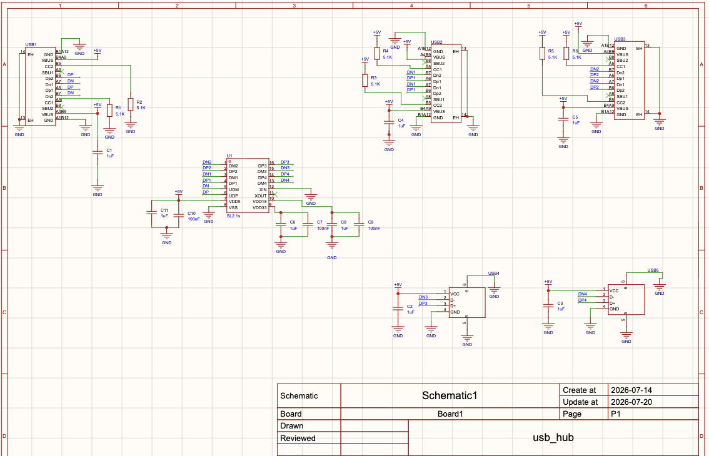
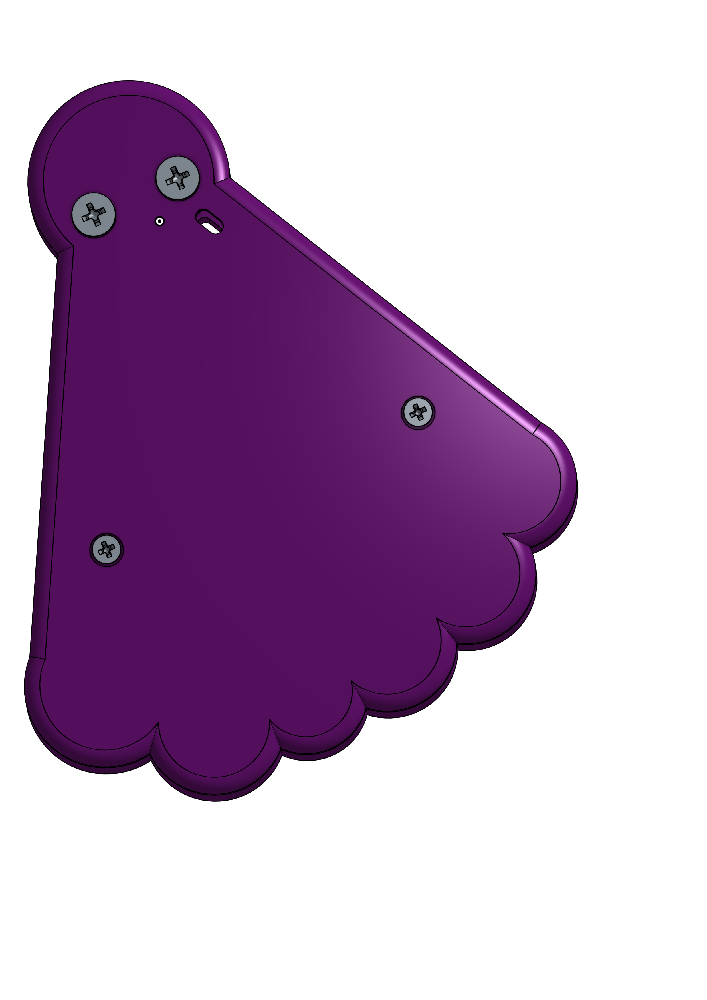
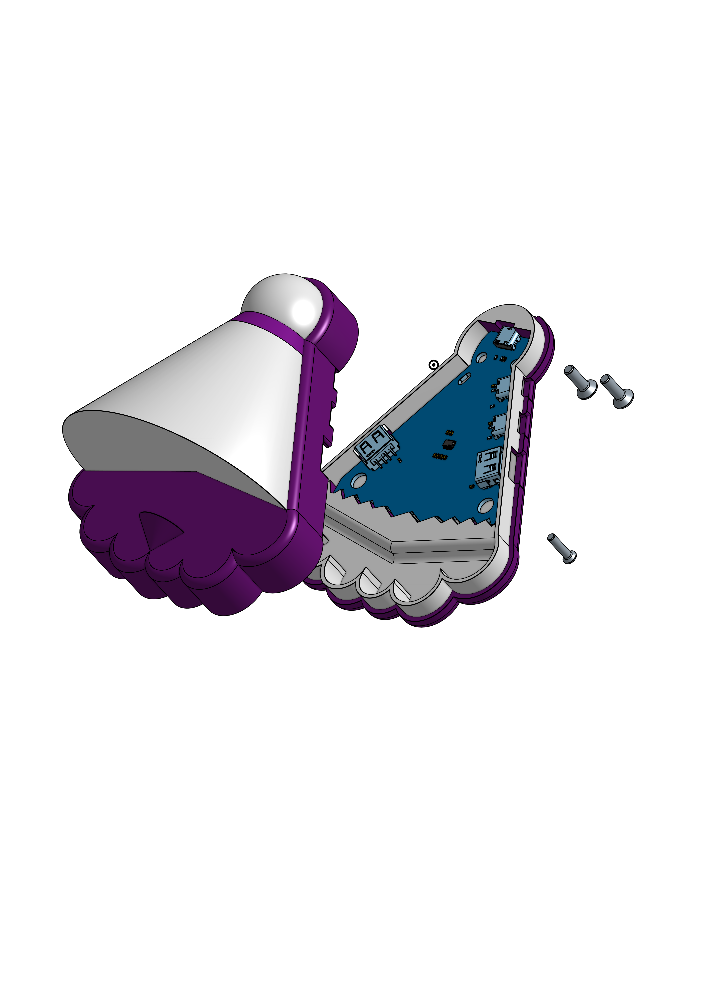
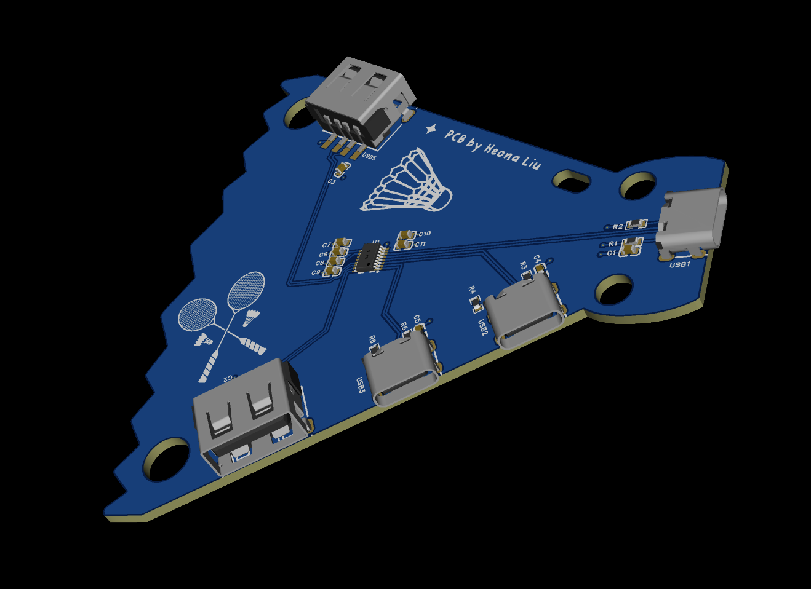
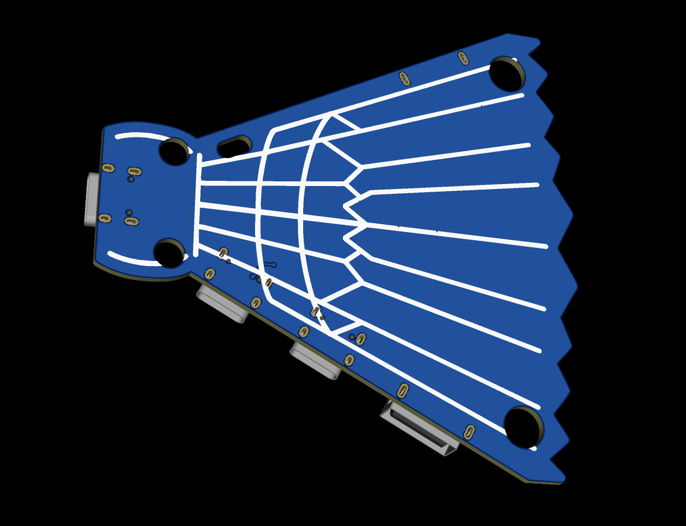
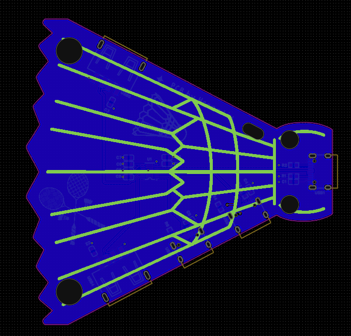

<h1 > 🏸🪻 Badminton USB Hub</h1>

A custom badminton shaped usb hub. CAD/Made by Heona Liu. Post event project (third hardware project!) This USB Hub was made by following the guide on the event's ([Hack Club Fallout](https://fallout.hackclub.com/)) Website by @rudy

This USB Hub has 2 Type-A and 2 Type-C downstream ports, and 1 Type-C upstream port. Additionally, the custom shape on the top of the cover doubles as a phone stand where you can place your phone horizontally/vertically!

# Overview of How it Works:
This USB Hub uses SL2.1S from CoreChips which allows the connection to split between multiple downstream ports. This hub allows 2 Type A, 2 Type C downstream ports, and 1 upstream Type C port. The Case is mounted together with 2 M3 Screws and 2 M4 Screws (all 14mm in length)

## Why I Built This Project
Continuing to build on my journey of learning hardware - I decided to build this USB Hub. Not only am I able to create something that makes it convinient for me to take around, but also can build something useful for me and my friends. Still a beginner in hardware and I need more practice working in the hardware process. This was built using EasyEDA Pro which is sort of a different interface than KiCad. After trying both interfaces, I do like how EasyEDA is linked directly with JLCPCB website.

### Key Parts Used:
- TYPE-C 16PIN 2MD(073)
- TYPE-A 10.0 QHHTZB6.3
- Channel Configuration Pins
- Case: Built with OnShape View [on ONSHAPE Here](https://cad.onshape.com/documents/2259728f690d73d5d9585bb0/w/b486cc7c642923e97de7bbc9/e/bfe7dceb3fea92c5286a4edb?renderMode=0&uiState=6a7e02fb6343551e6343cc9e)
- Mounting: 2 M3 Screws at the Bottom, 2 M4 Screws at the Top. 
- Extra small hole to slide a thread/string through to hang as a keychain!

## Schematic

## Firmware
- This is a USB Hub that takes connections and connects with downstream ports. There is no firmware here.

## Case Showcase
| **Top** | **Top Side View** |
| :--: | :--: |
|  | |
| **Bottom** | **Exploded View** |
|  | |

## PCB & Routing
| **Top** |  **Top Routing Layer** |
| :--: | :--: |
 | |
| **Bottom** | **Bottom Routing Layer** |
|  | |

## BOM
|No.|Quantity|Comment|Designator|Footprint|Value|Manufacturer Part|Manufacturer|Supplier Part|Supplier|MOQ|Total Price|Links|
|---|--------|---------------------|------------------------|--------------------------------|-----|---------------------|---------------|-------------|--------|----|-----------|-----------------------------------------------------------------|
|1|8|1uF|C1,C2,C3,C4,C5,C6,C8,C11|C0603|1uF|CL10A105KB8NNNC|SAMSUNG(三星)|C15849|LCSC|1 |0.22|https://jlcpcb.com/partdetail/16531-CL10A105KB8NNNC/C15849|
|2|3|100nF|C7,C9,C10|C0603|100nF|CC0603KRX7R9BB104|YAGEO(国巨)|C14663|LCSC|1|0.06|https://jlcpcb.com/partdetail/16532-CC0603KRX7R9BB104/C14663|
|3|6|5.1K   |R1,R2,R3,R4,R5,R6|R0603|5.1K |0603WAF5101T5E|UNI-ROYAL(厚声)|C23186|LCSC|1|0.02|https://jlcpcb.com/partdetail/16533-0603WAF5101T5E/C23186|
|4|1|SL2.1s |U1 |SSOP-16_L4.6-W2.6-P0.53-LS4.0-BL||SL2.1s |CoreChips(和芯润德)|C2684433|LCSC|1|0.25|https://jlcpcb.com/partdetail/16534(SL2.1s)/C2684433|
|5|3|TYPE-C 16PIN 2MD(073)|USB１,USB２,USB３|USB-C-SMD_TYPE-C-16PIN-2MD-073||TYPE-C 16PIN 2MD(073)|SHOU HAN(首韩)   |C2765186     |LCSC|1   |0.22|[https://jlcpcb.com/partdetail/16535(TYPE-C16PIN2MD(073))/C2765186](https://jlcpcb.com/partdetail/16535(TYPE-C16PIN2MD(073))/C2765186)|
|6|2|10.0 QHHTZB6.3|USB4,USB5 |USB-A-TH_10.0QHHTZB6.3||10.0 QHHTZB6.3|SHOU HAN(首韩)|C668591|LCSC|1|0.13|https://jlcpcb.com/partdetail/16536(10.0QHHTZB6.3)/C668591|
||23|**Total Price**|||||||||**$0.9**|

## How To Use It

by Heona Liu 2026